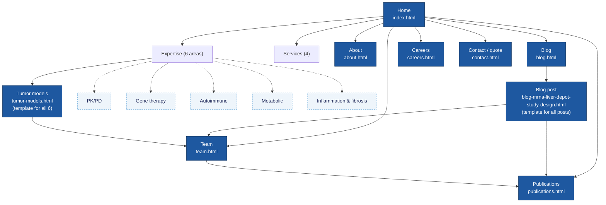
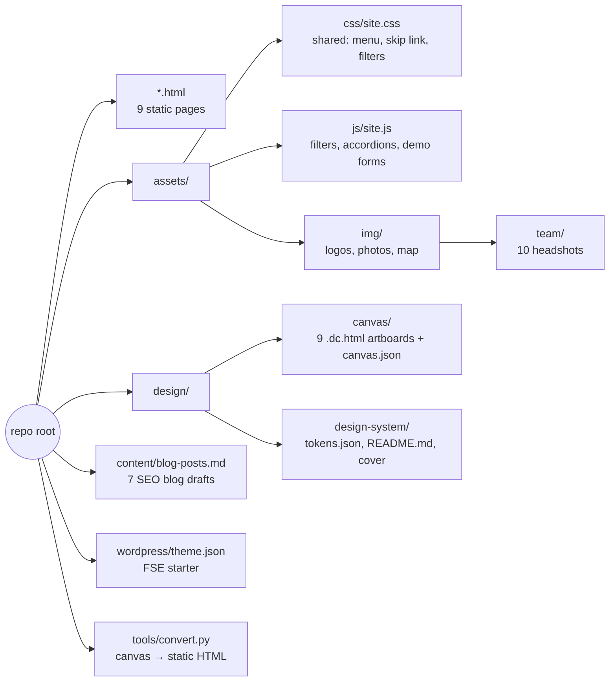
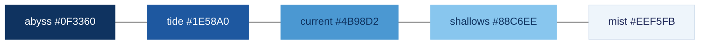
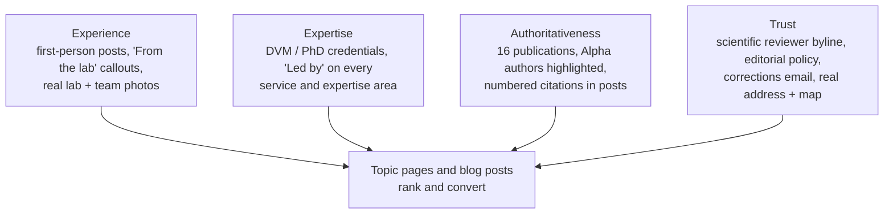
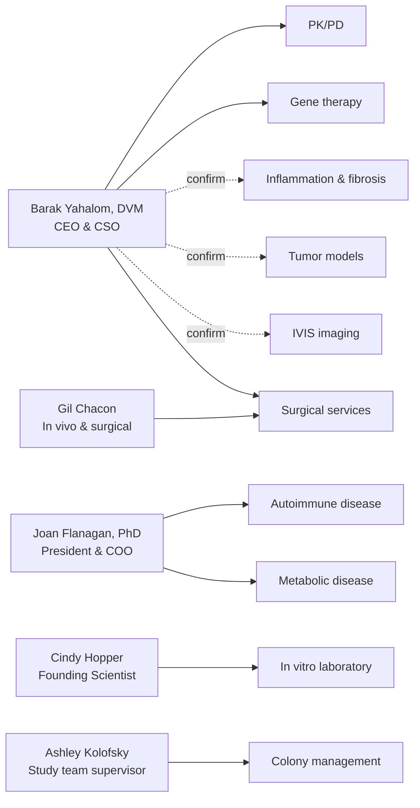
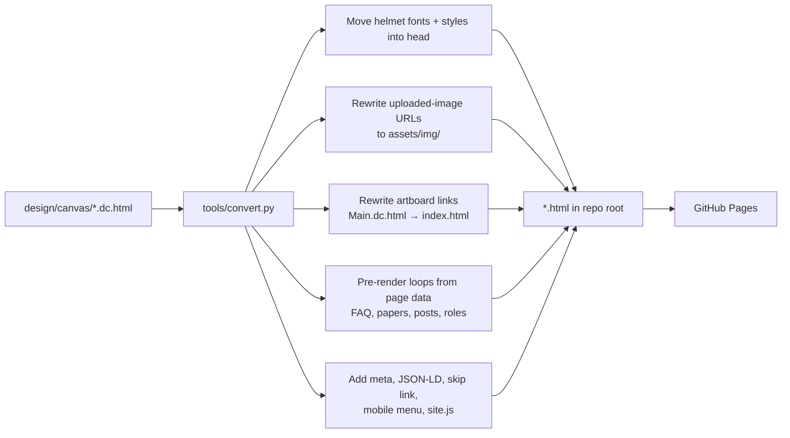
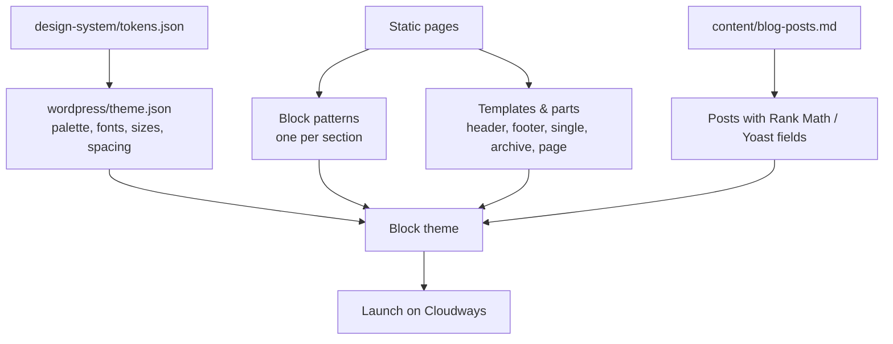

# Alpha Preclinical — Website Redesign

A full redesign of [alphapreclinical.com](https://www.alphapreclinical.com/) for Alpha Preclinical LLC, a preclinical in vivo contract research organization (CRO) at 722 Plantation Street, Worcester, MA.

This repo holds three things:

1. **A static preview site** (the HTML pages in the root) that runs on GitHub Pages, for client review.
2. **The design source**: the design-canvas artboards, the design system, and the blog drafts written during the design session.
3. **A starter `theme.json`** for the production build as a WordPress full-site-editing (FSE) block theme.

**Live preview:** https://cptnope.github.io/Alpha-Preclinical/ (once GitHub Pages is serving `main`)

> [!IMPORTANT]
> This is a **review build**, not the production site. Forms validate and confirm on screen but send nothing, PDF and share links are placeholders, and several items still need client confirmation (see [Open items](#open-items-before-launch)).

---

## Contents

- [Design direction](#design-direction)
- [Site map](#site-map)
- [Pages](#pages)
- [Repository structure](#repository-structure)
- [Design system](#design-system)
- [SEO and E-E-A-T](#seo-and-e-e-a-t)
- [Who leads what](#who-leads-what)
- [How the preview site is built](#how-the-preview-site-is-built)
- [Deploying to GitHub Pages](#deploying-to-github-pages)
- [Moving to WordPress FSE](#moving-to-wordpress-fse)
- [Open items before launch](#open-items-before-launch)
- [Asset ownership](#asset-ownership)

---

## Design direction

The brand's colors are kept exactly. They were sampled from the existing logo and the layered-wave hero art, which also appears on the building signage.

**The signature idea is "strata".** The alpha in the logo is filled with stacked bands of blue. On the site that becomes five flowing wave bands in the brand blues: drifting slowly in the homepage hero and dissolving into the page, then reduced to a single contour line or a wave-cut photo edge everywhere else. The site visually matches the sign visitors see at the entrance.

The client's two reference sites shaped different parts of the work:

| Reference | What it contributed |
| --- | --- |
| [Wave Life Sciences](https://wavelifesciences.com/) | Visual polish: generous white space, pill buttons, wave-line motifs, confident type |
| [Melior Discovery](https://www.meliordiscovery.com/) | Information architecture that ranks: therapeutic areas as crawlable links, specific capabilities, proof points, publications, FAQ, repeated quote CTAs |


---

## Site map



Solid boxes are designed and built. Dashed boxes reuse the tumor-models template and still need their own content.

---

## Pages

| Page | File | Interactive in preview | What it does |
| --- | --- | --- | --- |
| Home | `index.html` | FAQ accordion, mobile menu | Hero with animated strata, 6 expertise areas with leads, 4 services, study process, featured publications, team, FAQ, quote CTA |
| Tumor models | `tumor-models.html` | — | Template for each disease-model page: models table, in-house endpoints, study team, related expertise |
| Publications | `publications.html` | Filter by research area | All 16 papers grouped by area, Alpha authors called out |
| About | `about.html` | — | Company story, key facts, values, facility, leadership |
| Team | `team.html` | Photo swap on hover | Group photo, leadership and founding team profiles with education, prior roles, affiliations and the areas each person leads |
| Blog | `blog.html` | Filter by topic | Index of the seven launch posts |
| Blog post | `blog-mrna-liver-depot-study-design.html` | — | Single-post template built for E-E-A-T (see below) |
| Contact | `contact.html` | Demo form with validation | Quote form with study-type picker, contact details, building photo, branded map |
| Careers | `careers.html` | Role filter, accordion, demo application form | Culture, four open roles, application form with resume upload |

---

## Repository structure



```text
.
├── index.html, about.html, team.html, publications.html, blog.html,
│   blog-mrna-liver-depot-study-design.html, tumor-models.html,
│   contact.html, careers.html          # generated preview pages
├── assets/
│   ├── css/site.css                     # shared styles (each page also keeps its own inline styles)
│   ├── js/site.js                       # no-dependency behavior
│   └── img/                             # logos, lab + building photos, map, team/
├── design/
│   ├── canvas/                          # design-canvas source artboards (*.dc.html) + canvas.json
│   └── design-system/                   # tokens.json, README.md (brand book), Cover preview
├── content/blog-posts.md                # all 7 blog drafts with SEO fields and sources
├── wordpress/theme.json                 # token mapping for the FSE block theme
├── tools/convert.py                     # regenerates the HTML pages from design/canvas
├── .nojekyll                            # serve files as-is on GitHub Pages
└── LICENSE
```

---

## Design system

The full brand book is in [`design/design-system/README.md`](design/design-system/README.md) and the tokens in [`design/design-system/tokens.json`](design/design-system/tokens.json).

### Color

| Token | Hex | Role | Contrast |
| --- | --- | --- | --- |
| `navy` | `#1F2858` | Ink: headings and body text (the wordmark color) | 14:1 on white |
| `abyss` | `#0F3360` | Dark surface: hero, CTA bands, footer | white text 12.6:1 |
| `tide` | `#1E58A0` | Action: buttons, links, focus | 7.1:1 on white |
| `current` | `#4B98D2` | Wave band, rules, icons (never body text) | 3.1:1, decorative only |
| `shallows` | `#88C6EE` | Lightest band; accent and buttons on `abyss` | 6.8:1 on abyss |
| `mist` | `#EEF5FB` | Alternate section background | — |
| `ink-muted` | `#4A5878` | Secondary text on white | 7.1:1 |
| `ink-on-abyss` | `#B9CCE3` | Secondary text on `abyss` | 7.7:1 |



The five strata bands, deepest to lightest, as they stack in the hero.

### Type

| Role | Family | Use |
| --- | --- | --- |
| Display | **Bricolage Grotesque** 600, tracked −0.025em | Headings only |
| Body | **Figtree** 400–600 | Text, navigation, buttons (echoes the wordmark's round geometry) |

Rules: sentence-case headings, no all-caps labels, line length under ~72 characters, one primary action per view, motion only in the hero (frozen under `prefers-reduced-motion`).

---

## SEO and E-E-A-T

Alpha's strongest ranking asset is that real scientists with published research run the studies. The design surfaces that wherever it can.



| Element | Where |
| --- | --- |
| Unique `<title>` and meta description per page | All pages (`tools/convert.py`) |
| One H1 per page, keyword first | All pages |
| `Organization` and `FAQPage` JSON-LD | `index.html` |
| `Article` JSON-LD with author, reviewer and citations | Blog post |
| Breadcrumbs | All inner pages |
| Author byline, reviewer, published/updated dates, author bio box | Blog post |
| Related team publications and related posts | Blog post |
| "Led by" lines and study-team block linking to Team profiles | Home, tumor models template, Team |
| Internal links between expertise, team, publications and blog | Throughout |

The seven launch posts in [`content/blog-posts.md`](content/blog-posts.md) each include a title tag, meta description, slug, primary and secondary keywords, and the internal links to add.

| # | Post | Author | Primary keyword |
| --- | --- | --- | --- |
| 1 | How to scope your first in vivo efficacy study | Barak Yahalom, DVM | in vivo efficacy study |
| 2 | Caliper or IVIS? Choosing how to measure tumor burden | Barak Yahalom, DVM | tumor volume caliper vs bioluminescence imaging |
| 3 | Diet-induced versus genetic models of type 2 diabetes | Joan Flanagan, PhD | type 2 diabetes animal models |
| 4 | What an mRNA liver depot study looks like in practice | Barak Yahalom, DVM | mRNA LNP in vivo study |
| 5 | Getting more from every animal with in-house flow cytometry | Cindy Hopper | mouse immunophenotyping flow cytometry |
| 6 | Continuous dosing with Alzet pumps: when and why | Gil Chacon | Alzet osmotic pump |
| 7 | Spontaneous rat models of type 1 diabetes, explained | Joan Flanagan, PhD | type 1 diabetes rat model |

---

## Who leads what

Each service and expertise area names the person who leads it, and each Team profile links back. Only connections backed by a bio or publication were made; three default to the CSO and need confirming.



| Area | Lead | Evidence |
| --- | --- | --- |
| PK/PD | Barak | Directed in vivo pharmacology at several biotechs |
| Gene therapy | Barak | Fabry and hemophilia B mRNA papers |
| Autoimmune disease | Joan | LEW.1WR1 type 1 diabetes paper |
| Metabolic disease | Joan | BBZDR/Wor and metabolic syndrome papers |
| Surgical services | Barak and Gil | Staff DVM; Gil provides surgical support |
| Colony management | Ashley | Vivarium operations |
| In vitro laboratory | Cindy | Leads in vitro services |
| Inflammation & fibrosis, tumor models, IVIS | Barak | **Assumed (CSO). Confirm with client.** |

---

## How the preview site is built

The designs were made on a design canvas whose artboards (`design/canvas/*.dc.html`) need that tool's runtime. `tools/convert.py` turns them into plain HTML that runs anywhere.



To regenerate after editing an artboard (needs Python 3 and Node.js, which evaluates each page's data arrays):

```bash
python3 tools/convert.py design/canvas .
```

The script stops with an error if any template syntax (`{{ }}`, `<sc-for>`, `<sc-if>`) is left unconverted.

To preview locally:

```bash
python3 -m http.server 8000
# open http://localhost:8000
```

---

## Deploying to GitHub Pages

1. Repo **Settings → Pages**.
2. **Source:** Deploy from a branch. **Branch:** `main`, folder `/ (root)`.
3. Save. The site publishes at `https://cptnope.github.io/Alpha-Preclinical/` within a minute or two.

All paths are relative, so the site works under the `/Alpha-Preclinical/` subpath without changes. `.nojekyll` makes Pages serve files as-is.

---

## Moving to WordPress FSE



| Static piece | FSE equivalent |
| --- | --- |
| Header / footer | `parts/header.html`, `parts/footer.html` (Navigation block) |
| Hero with strata | Block pattern: Cover or Group with inline SVG bands |
| Expertise list with leads | Pattern + a relationship field from each service page to a Team member |
| Publications | Custom post type `publication` (area taxonomy, authors, journal, year, DOI, PDF) with a Query Loop |
| Blog post | `single.html` template; author box from user profile; `Article` schema via SEO plugin |
| Team profiles | Custom post type `team_member`; `Person` schema with `sameAs` (ORCID, Google Scholar, LinkedIn) |
| Contact and careers forms | Gravity Forms or Fluent Forms; route study type to the right inbox |
| Open roles | Custom post type `job` with `JobPosting` schema |

`wordpress/theme.json` already maps the palette, both font families, the type scale, spacing scale and button style. Add the woff2 files to `assets/fonts/` in the theme (download Bricolage Grotesque and Figtree from Google Fonts and self-host them).

---

## Open items before launch

### Confirm with the client

- [ ] Job titles for Ashley, Cindy and Gil (written from their old role descriptions)
- [ ] Cindy's bio edit (homeopathy reference changed to "preventive approaches to medicine")
- [ ] Joan's Becker College advisory board line (Becker College closed in 2021)
- [ ] Leads for inflammation & fibrosis, tumor models and IVIS (defaulted to Barak)
- [ ] Alpha's role on three LNP papers with no confirmed Alpha author
- [ ] Location for job postings: old posts say **North Grafton, MA**; site says Worcester
- [ ] Whether the four open roles are still open
- [ ] Editorial policy on the blog post (claims a second PhD/DVM review)
- [ ] Phone number, if they want one listed

### Content to collect

- [ ] Original full-resolution photos (current images were pulled from Wix at 1,000 px)
- [ ] Journal, year, volume and DOI for each publication, plus PDFs
- [ ] ORCID / Google Scholar links for Barak and Joan
- [ ] Real lab photos for each therapeutic area
- [ ] Model names and strains for each disease-model page
- [ ] Author review of each blog post, plus one first-hand detail per post

### Build tasks

- [ ] Privacy policy page (forms collect work emails)
- [ ] Five remaining expertise pages from the tumor-models template
- [ ] Real form handling and spam protection
- [ ] `JobPosting`, `Person` and `ScholarlyArticle` schema
- [ ] XML sitemap and redirects from old Wix URLs (`/experetise`, `/services`, `/about-us`, `/pk-pd`, …)

---

## Asset ownership

The MIT license covers the code in this repo (HTML structure, CSS, JavaScript, `tools/`). **It does not cover the client's assets**: the Alpha Preclinical name and logo, team and facility photos, and the client's written content belong to Alpha Preclinical LLC and are included only for this redesign. The map image is derived from © OpenStreetMap contributors data (ODbL).
