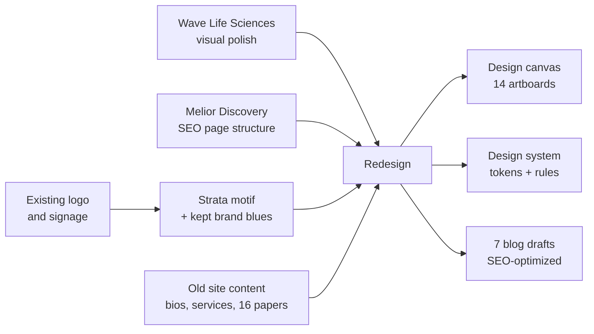
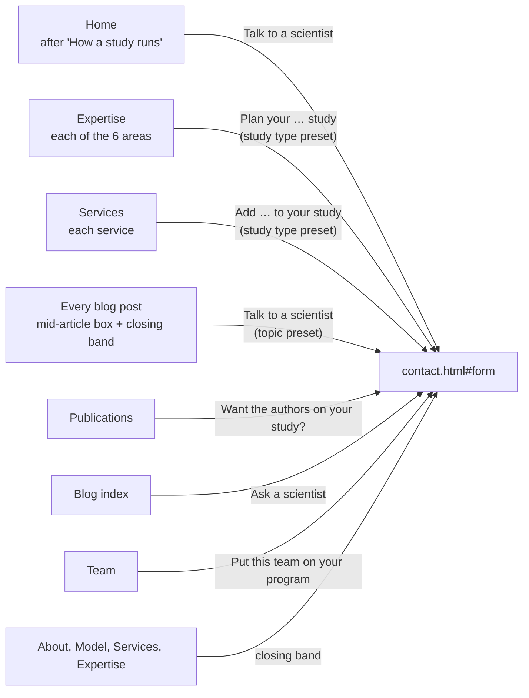
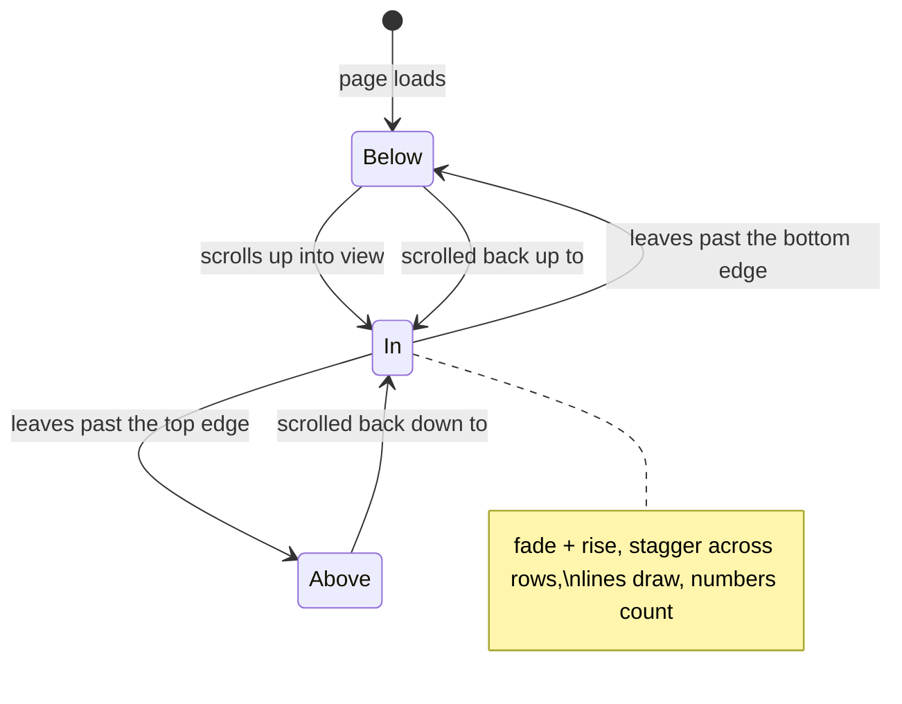
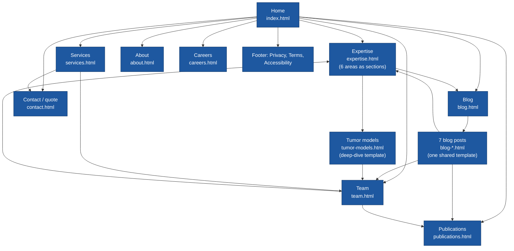
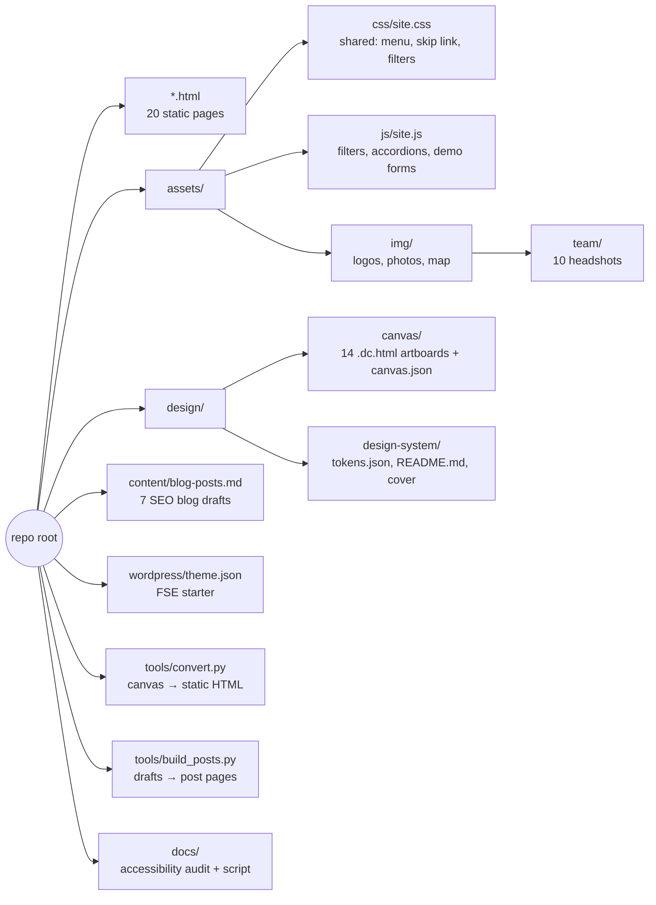
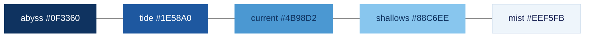
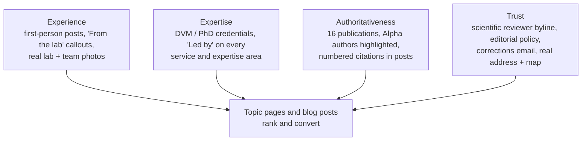
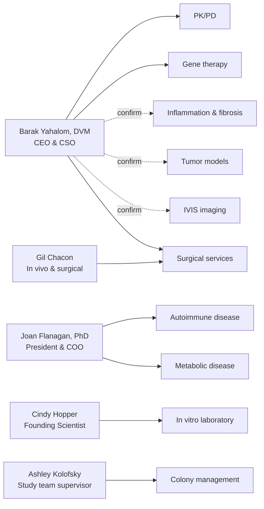
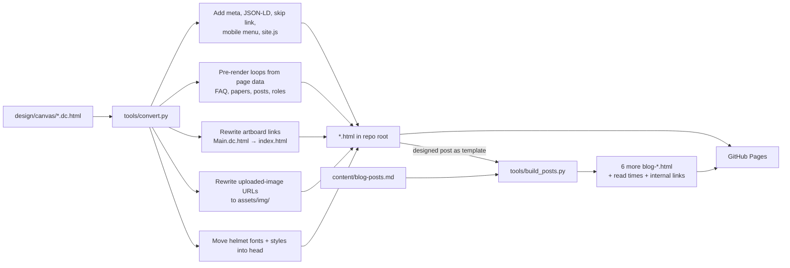
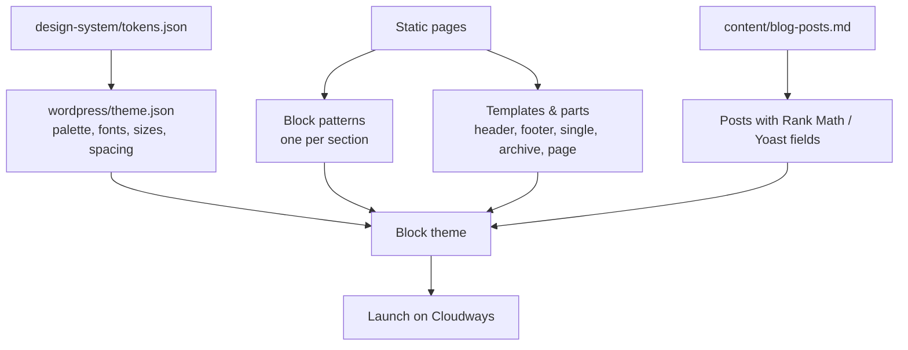

# Alpha Preclinical — Website Redesign

A full redesign of [alphapreclinical.com](https://www.alphapreclinical.com/) for Alpha Preclinical LLC, a preclinical in vivo contract research organization (CRO) at 722 Plantation Street, Worcester, MA.

This repo holds three things:

1. **A static preview site** (the HTML pages in the root) that runs on GitHub Pages, for client review.
2. **The design source**: the design-canvas artboards, the design system, and the blog drafts written during the design session.
3. **A starter `theme.json`** for the production build as a WordPress full-site-editing (FSE) block theme.

**Live preview:** https://cptnope.github.io/Alpha-Preclinical/ (once GitHub Pages is serving `main`)

> [!IMPORTANT]
> This is a **review build**, not the production site. Forms validate and confirm on screen but send nothing, blog share links are placeholders, publication PDFs are still served from the old site, and several items still need client confirmation (see [Open items](#open-items-before-launch)).

---

## Contents

- [Design direction](#design-direction)
- [Navigation order](#navigation-order)
- [Calls to action](#calls-to-action)
- [Motion](#motion)
- [Site map](#site-map)
- [Pages](#pages)
- [Repository structure](#repository-structure)
- [Design system](#design-system)
- [SEO and E-E-A-T](#seo-and-e-e-a-t)
- [Who leads what](#who-leads-what)
- [How the preview site is built](#how-the-preview-site-is-built)
- [Deploying to GitHub Pages](#deploying-to-github-pages)
- [Moving to WordPress FSE](#moving-to-wordpress-fse)
- [Accessibility](#accessibility)
- [Open items before launch](#open-items-before-launch)
- [Asset ownership](#asset-ownership)

---

## Design direction

The brand's colors are kept exactly. They were sampled from the existing logo and the layered-wave hero art, which also appears on the building signage.

**The signature idea is "strata".** The alpha in the logo is filled with stacked bands of blue. On the site that becomes five flowing wave bands in the brand blues: drifting slowly in the homepage hero and dissolving into the page. Every inner page carries a shorter band of the same waves that also drifts (and blog posts a thin one under the header), each with its own pause button. The site visually matches the sign visitors see at the entrance.

The client's two reference sites shaped different parts of the work:

| Reference | What it contributed |
| --- | --- |
| [Wave Life Sciences](https://wavelifesciences.com/) | Visual polish: generous white space, pill buttons, wave-line motifs, confident type |
| [Melior Discovery](https://www.meliordiscovery.com/) | Information architecture that ranks: therapeutic areas as crawlable links, specific capabilities, proof points, publications, FAQ, repeated quote CTAs |



---

## Navigation order

**Expertise · Services · Publications · About · Team · Blog · Careers · Contact**, the same in the header, the mobile menu and the footer's Company column. It follows a buyer's questions in order: *can you run my model* (Expertise, Services), *can I trust the science* (Publications), *who are you* (About, Team), then supporting content, hiring and contact. "Request a study quote" stays as the header button on every page.

## Calls to action

Every study CTA lands on the contact form. Links from an area or service pass the study type, so the form opens with it already chosen (`contact.html?study=Tumor%20models#form`, read by `assets/js/site.js`).



## Motion

All motion is decorative, built from the strata wave idea, uses one easing curve, and is switched off entirely when a visitor's device asks for reduced motion (or JavaScript is off). It lives in `assets/css/site.css` and `assets/js/site.js`, so the design canvas shows the resting state.



| Motion | Where | Desktop | Phone |
| --- | --- | --- | --- |
| Drifting wave bands | Every page header | Continuous, with a Pause button (WCAG 2.2.2) | Same |
| Header content rises in, then drifts up and softens as you scroll past | Every page | 90 px parallax, fades no lower than 30% | 40 px parallax |
| Sections play in as they arrive and back out toward the edge they leave by | Cards, lists, steps, papers, team, bands | 26 px travel, 0.75 s, up to 4-step stagger | 16 px, 0.55 s, 2-step stagger |
| Contour lines draw in, rewind on exit | CTA bands, closing CTA | 2.4 s | Same |
| Process connectors draw after each step | Home | Yes | Hidden in the stacked layout |
| Numbers count up each time they arrive | Home hero stats, "16 papers" | Real number stays in an `aria-label` | Same |
| Photos settle from a slight zoom | Revealed sections with photos | Yes | Off |
| FAQ answers, open roles and the mobile menu ease open | Home, Careers, every page | Yes | Full-screen menu: links stagger in, then the quote button and contact details; X closes, page behind does not scroll |
| Hover: cards lift, nav underline grows, arrows nudge, faces zoom slightly | Site-wide | Mouse and trackpad only | Off, so taps don't leave cards stuck |

Keyboard focus always reveals the section it lands in, and the mobile menu closes with Escape.

---

## Site map



Every page is designed and built. The six expertise areas are sections of `expertise.html` (anchors `#pk-pd`, `#gene-therapy`, `#autoimmune`, `#metabolic`, `#fibrosis`, `#tumor`); `tumor-models.html` shows how any area can grow into its own deep-dive page later.

---

## Pages

20 pages, listed in navigation order. Every page also has the mobile menu, the drifting wave header with its Pause button, scroll-in motion, the "Request a study quote" header button and the footer (with the company LinkedIn).

| Page | File | Interactive in preview | What's on it | Calls to action | Schema and E-E-A-T |
| --- | --- | --- | --- | --- | --- |
| Home | `index.html` | FAQ accordion, count-up stats | A short front door to the full pages: hero, 6 expertise areas with leads, 4 service tiles, how a study runs, 3 featured papers (gene therapy, type 1 diabetes, anesthesia) with headline stats, the team in one row, FAQ | Hero quote button; "Talk to a scientist" after the process; closing quote band | `Organization`, `FAQPage` |
| Expertise | `expertise.html` | Jump links to each area | All six therapeutic areas: overview, the models from the old site in a table, the lead scientist, related papers and blog posts | "Plan your … study" under each area (study type preset); closing band | Lead named on every area |
| Services | `services.html` | Jump links to each service | Study types, then IVIS imaging, surgical services, colony management, in vitro laboratory and study support, each with its lead | "Add … to your study" under each service (study type preset); closing band | Lead named on every service |
| Tumor models | `tumor-models.html` | — | Deep-dive template for one area: models table, in-house endpoints, study team, related expertise | Closing quote band | Study team named |
| Publications | `publications.html` | Filter by research area | All 16 papers grouped by area with a full NLM-style citation (journal, issue date, volume, issue, pages, epub date), DOI link, PMID and PMCID, Alpha authors called out; **Read PDF**, **PubMed** (15 of 16) and **Free full text** on PubMed Central (8) | "Want the authors on your study?" band | `ScholarlyArticle` list with authors, volume, issue, pagination, date, and DOI / PMID / PMCID identifiers |
| About | `about.html` | — | Company story, key facts, values, facility, leadership | Closing quote band | Founding date, leadership |
| Team | `team.html` | Photo swap on hover | Group photo, leadership and founding team profiles with education, prior roles, affiliations, the areas each person leads, bios rewritten for E-E-A-T (role and client value first, then experience and credentials, then published research by journal and year), **Selected publications** for Barak and Joan, **LinkedIn** for Barak, Joan and Ashley, and **PubMed** for Barak (8 papers) and Joan (4) | "Put this team on your program" band; careers link | `Person` list with description, job title, image, `alumniOf`, `knowsAbout`, `memberOf` and LinkedIn `sameAs` |
| Blog | `blog.html` | Filter by topic | Index of the seven launch posts, all linked | "Ask a scientist" band | — |
| Blog post (designed) | `blog-mrna-liver-depot-study-design.html` | — | Single-post template built for E-E-A-T (see below) | Mid-article "Talk to a scientist" box; closing band | `Article`; author and reviewer; author LinkedIn and PubMed; related papers link to PDFs |
| Blog posts (generated) | `blog-how-to-scope-in-vivo-efficacy-study.html`, `blog-caliper-vs-ivis-tumor-burden.html`, `blog-diet-induced-vs-genetic-type-2-diabetes-models.html`, `blog-flow-cytometry-immunophenotyping-in-vivo-studies.html`, `blog-alzet-osmotic-pump-continuous-dosing.html`, `blog-rat-models-type-1-diabetes.html` | — | The other six drafts on the same template: author and reviewer, contents, key takeaways, sources, related Alpha papers | Mid-article box (topic preset) and closing band | Same as the designed post; LinkedIn and PubMed where the author has them. "How to scope", "Caliper or IVIS?", "Diet-induced versus genetic" and the mRNA liver depot post have illustrated heroes (uncropped, descriptive alt text, social share image), also used on their Blog page cards. To add one for another post: save `assets/img/blog/<name>-1200.jpg` (+ a larger copy), add an `infographic` entry to that post in `POSTS` (`tools/build_posts.py`) and an `img` field to the post in `design/canvas/Blog.dc.html` |
| Careers | `careers.html` | Role filter, accordion, demo application form | Culture, four open roles, application form with resume upload | "Apply for this role" preselects the role | — |
| Contact | `contact.html` | Demo form with validation; study type preset from `?study=` | Quote form with study-type picker, contact details, building photo, branded map | Destination of every study CTA | `Organization` address |
| Privacy policy | `privacy.html` | — | **Draft for legal review.** What the forms collect, how it is used and shared, retention, rights | — | — |
| Terms of use | `terms.html` | — | **Draft for legal review.** Site use, studies governed by separate agreements, IP, disclaimers, Massachusetts law | — | — |
| Accessibility statement | `accessibility.html` | — | WCAG 2.1 AA commitment, what was done, how it was tested, known limitations, how to get help | — | — |

---

## Repository structure



```text
.
├── index.html, about.html, team.html, publications.html, blog.html,
│   services.html, expertise.html, tumor-models.html,
│   blog-*.html (7 posts),
│   contact.html, careers.html,
│   privacy.html, terms.html, accessibility.html   # generated preview pages
├── assets/
│   ├── css/site.css                     # shared styles (each page also keeps its own inline styles)
│   ├── js/site.js                       # no-dependency behavior
│   └── img/                             # logos, lab + building photos, map, team/
├── design/
│   ├── canvas/                          # design-canvas source artboards (*.dc.html) + canvas.json
│   └── design-system/                   # tokens.json, README.md (brand book), Cover preview
├── content/blog-posts.md                # all 7 blog drafts with SEO fields and sources
├── wordpress/theme.json                 # token mapping for the FSE block theme
├── tools/convert.py                     # regenerates the HTML pages from design/canvas
├── tools/build_posts.py                 # builds the six other posts from content/blog-posts.md
├── tools/pdf_links.py                   # links paper titles to their PDFs
├── docs/accessibility-audit.md          # WCAG 2.1 AA audit report
├── docs/a11y-audit.py                   # re-runnable audit (axe-core + custom checks)
├── .nojekyll                            # serve files as-is on GitHub Pages
└── LICENSE
```

---

## Design system

The full brand book is in [`design/design-system/README.md`](design/design-system/README.md) and the tokens in [`design/design-system/tokens.json`](design/design-system/tokens.json).

### Color

| Token | Hex | Role | Contrast |
| --- | --- | --- | --- |
| `navy` | `#1F2858` | Ink: headings and body text (the wordmark color) | 14:1 on white |
| `abyss` | `#0F3360` | Dark surface: hero, CTA bands, footer | white text 12.6:1 |
| `tide` | `#1E58A0` | Action: buttons, links, focus | 7.1:1 on white |
| `current` | `#4B98D2` | Wave band, rules, icons (never body text) | 3.1:1, decorative only |
| `shallows` | `#88C6EE` | Lightest band; accent and buttons on `abyss` | 6.8:1 on abyss |
| `mist` | `#EEF5FB` | Alternate section background | — |
| `ink-muted` | `#4A5878` | Secondary text on white | 7.1:1 |
| `ink-on-abyss` | `#B9CCE3` | Secondary text on `abyss` | 7.7:1 |



The five strata bands, deepest to lightest, as they stack in the hero.

### Type

| Role | Family | Use |
| --- | --- | --- |
| Display | **Bricolage Grotesque** 600, tracked −0.025em | Headings only |
| Body | **Figtree** 400–600 | Text, navigation, buttons (echoes the wordmark's round geometry) |

Rules: sentence-case headings, no all-caps labels, line length under ~72 characters, one primary action per view, motion only in the hero (frozen under `prefers-reduced-motion`).

---

## SEO and E-E-A-T

Alpha's strongest ranking asset is that real scientists with published research run the studies. The design surfaces that wherever it can.



| Element | Where |
| --- | --- |
| Unique `<title>` and meta description per page | All pages (`tools/convert.py`) |
| One H1 per page, keyword first | All pages |
| `Organization` and `FAQPage` JSON-LD | `index.html` |
| `Article` JSON-LD with author, reviewer and citations | Blog post |
| Breadcrumbs | All inner pages |
| Author byline, reviewer, published/updated dates, author bio box | Blog post |
| Related team publications and related posts | Blog post |
| "Led by" lines and study-team block linking to Team profiles | Home, tumor models template, Team |
| Internal links between expertise, team, publications and blog | Throughout |

The seven launch posts in [`content/blog-posts.md`](content/blog-posts.md) each include a title tag, meta description, slug, primary and secondary keywords, and the internal links to add.

| # | Post | Author | Primary keyword |
| --- | --- | --- | --- |
| 1 | How to scope your first in vivo efficacy study | Barak Yahalom, DVM | in vivo efficacy study |
| 2 | Caliper or IVIS? Choosing how to measure tumor burden | Barak Yahalom, DVM | tumor volume caliper vs bioluminescence imaging |
| 3 | Diet-induced versus genetic models of type 2 diabetes | Joan Flanagan, PhD | type 2 diabetes animal models |
| 4 | What an mRNA liver depot study looks like in practice | Barak Yahalom, DVM | mRNA LNP in vivo study |
| 5 | Getting more from every animal with in-house flow cytometry | Cindy Hopper | mouse immunophenotyping flow cytometry |
| 6 | Continuous dosing with Alzet pumps: when and why | Gil Chacon | Alzet osmotic pump |
| 7 | Spontaneous rat models of type 1 diabetes, explained | Joan Flanagan, PhD | type 1 diabetes rat model |

---

### Publication metadata

Each paper's row in `design/canvas/Publications.dc.html` holds: area, title, authors, Alpha authors, journal, PDF, PMID, PMCID, DOI, volume, issue, pages, issue date and epub date. The page renders an NLM-style citation from them (for example *Gene Therapy*. 2016 Oct;23(10):699–707. Epub 2016 Jun 30.), plus DOI, PMID and PMCID, and the same fields go into `ScholarlyArticle` schema.

Values came from Crossref and OpenAlex, with PMIDs and PMCIDs cross-checked against the NCBI ID converter; PubMed itself blocked automated reads, so open items list the few dates to confirm there.

PubMed has no author profile pages, so each scientist's **PubMed** button runs a PubMed search for exactly the PMIDs of their papers on this site (a name search like "Flanagan J" would mix in other researchers). When papers are added, add the PMID to the person's list in `Team.dc.html`, `BlogPost.dc.html` and `PEOPLE` in `tools/build_posts.py`.

## Who leads what

Each service and expertise area names the person who leads it, and each Team profile links back. Only connections backed by a bio or publication were made; three default to the CSO and need confirming.



| Area | Lead | Evidence |
| --- | --- | --- |
| PK/PD | Barak | Directed in vivo pharmacology at several biotechs |
| Gene therapy | Barak | Fabry and hemophilia B mRNA papers |
| Autoimmune disease | Joan | LEW.1WR1 type 1 diabetes paper |
| Metabolic disease | Joan | BBZDR/Wor and metabolic syndrome papers |
| Surgical services | Barak and Gil | Staff DVM; Gil provides surgical support |
| Colony management | Ashley | Vivarium operations |
| In vitro laboratory | Cindy | Leads in vitro services |
| Inflammation & fibrosis, tumor models, IVIS | Barak | **Assumed (CSO). Confirm with client.** |

---

## How the preview site is built

The designs were made on a design canvas whose artboards (`design/canvas/*.dc.html`) need that tool's runtime. `tools/convert.py` turns them into plain HTML that runs anywhere.



To regenerate after editing an artboard or a blog draft (needs Python 3 with the `markdown` package, and Node.js, which evaluates each page's data arrays). Run both, in this order:

```bash
pip install markdown
python3 tools/convert.py design/canvas .
python3 tools/build_posts.py
```

`build_posts.py` also runs `tools/pdf_links.py`, which points every paper title on the site at that paper's PDF (URLs live in the `P` list in `design/canvas/Publications.dc.html`). It fills the designed post with each draft (the SEO table at the top of each draft becomes the title, meta and slug), sets read times from real word counts on every page, and points matching links across the site at the new posts.

The script stops with an error if any template syntax (`{{ }}`, `<sc-for>`, `<sc-if>`) is left unconverted.

To preview locally:

```bash
python3 -m http.server 8000
# open http://localhost:8000
```

---

## Deploying to GitHub Pages

1. Repo **Settings → Pages**.
2. **Source:** Deploy from a branch. **Branch:** `main`, folder `/ (root)`.
3. Save. The site publishes at `https://cptnope.github.io/Alpha-Preclinical/` within a minute or two.

All paths are relative, so the site works under the `/Alpha-Preclinical/` subpath without changes. `.nojekyll` makes Pages serve files as-is.

---

## Moving to WordPress FSE



| Static piece | FSE equivalent |
| --- | --- |
| Header / footer (same on every page) | `parts/header.html`, `parts/footer.html` (Navigation block) |
| Hero with strata | Block pattern: Cover or Group with inline SVG bands |
| Expertise list with leads | Pattern + a relationship field from each service page to a Team member |
| Publications | Custom post type `publication` (area taxonomy, authors, journal, year, DOI, PMID, PMCID, PDF) with a Query Loop |
| Blog post | `single.html` template; author box from user profile; `Article` schema via SEO plugin |
| Team profiles | Custom post type `team_member`; `Person` schema with `sameAs` (LinkedIn now; add ORCID and Google Scholar) |
| Contact and careers forms | Gravity Forms or Fluent Forms; route study type to the right inbox |
| Open roles | Custom post type `job` with `JobPosting` schema |

`wordpress/theme.json` already maps the palette, both font families, the type scale, spacing scale and button style. Add the woff2 files to `assets/fonts/` in the theme (download Bricolage Grotesque and Figtree from Google Fonts and self-host them).

---

## Accessibility

The site was audited against **WCAG 2.1 AA** (plus the WCAG 2.2 target-size rule). Full report: [`docs/accessibility-audit.md`](docs/accessibility-audit.md).

| Check | Result |
| --- | --- |
| axe-core (wcag2a, wcag2aa, wcag21a, wcag21aa) | 0 violations on all 20 pages |
| Reflow at 320 px and text spacing (1.4.10, 1.4.12) | Pass on all pages |
| Visible focus on every focusable element (2.4.7) | Pass |
| Wave animation can be paused (2.2.2) | Pause button on every page; starts paused under reduced motion. Scroll reveals and line drawing run once and finish in under 5 seconds |
| Filter results announced (4.1.3) | `role="status"` live region |
| Targets at least 24 px (2.5.8) | Pass, except links inside sentences (exempt) |

Re-run after changes:

```bash
python3 -m http.server 8766 &
AXE_PATH=path/to/axe.min.js python3 docs/a11y-audit.py http://localhost:8766 audit.json
```

---

## Open items before launch

### Confirm with the client

- [ ] Job titles for Ashley, Cindy and Gil (written from their old role descriptions)
- [ ] Cindy's bio edit (homeopathy reference changed to "preventive approaches to medicine")
- [ ] Have each person approve their rewritten bio. Every fact comes from the old site, the Team sidebars or their publication records; two links are inferred from the publications and worth a glance: Joan's SWI/SNF papers sit alongside her UMass Medical School training, and Barak's research is summarized by topic
- [ ] Joan's Becker College advisory board line (Becker College closed in 2021)
- [ ] Leads for inflammation & fibrosis, tumor models and IVIS (defaulted to Barak)
- [ ] Alpha's role on the three Sanofi / Translate Bio LNP papers (Analytical Chemistry 2024, Biomaterials 2023, J Mater Chem B 2026): no Alpha scientist is an author; the site shows "None listed". Keep them (e.g. as collaborator work) or remove
- [ ] Location for job postings: old posts say **North Grafton, MA**; site says Worcester
- [ ] Whether the four open roles are still open
- [ ] Editorial policy on the blog post (claims a second PhD/DVM review)
- [ ] Phone number, if they want one listed

### Content to collect

- [ ] Original full-resolution photos (current images were pulled from Wix at 1,000 px)
- [ ] Copy the 16 PDFs into the theme or media library before the old site goes offline (links currently point at `alphapreclinical.com/_files/ugd/…`), and confirm the client may host publisher versions; link the DOI where it can't
- [ ] ORCID / Google Scholar links for Barak and Joan
- [ ] LinkedIn profiles for Cindy Hopper and Gil Chacon (their old bio pages show a LinkedIn icon with no link; a "Cindy Hopper, UMass Chan" profile exists but isn't confirmed as her)
- [ ] Check three epub dates against PubMed, where Crossref and OpenAlex disagree: Diabetes 2012 (Crossref Apr 13, OpenAlex Feb 25), Pediatric Anesthesia 2021 (Jan 4 vs Dec 4, 2020), Anesthesiology 2011 (none vs May 7). The site shows the Crossref value or none
- [ ] ILAR Journal 2004: OpenAlex lists "John F. Flanagan"; the site keeps Joan F. Flanagan, as on the old site
- [ ] Real lab photos for each therapeutic area
- [ ] Confirm the model lists on the Expertise page are current (copied from the old site)
- [ ] Author review of each blog post, plus one first-hand detail per post

### Build tasks

- [ ] Attorney review of the draft Privacy Policy and Terms of Use (bracketed items depend on the final analytics, form and hosting tools)
- [ ] Response time for accessibility requests (Accessibility Statement)
- [ ] Screen-reader pass with VoiceOver and NVDA on staging
- [ ] Share links on blog posts (placeholders)
- [ ] Real form handling and spam protection
- [ ] `JobPosting` schema (`Person` and `ScholarlyArticle` are done)
- [ ] XML sitemap and redirects from old Wix URLs (`/experetise`, `/services`, `/about-us`, `/pk-pd`, …)

---

## Asset ownership

The MIT license covers the code in this repo (HTML structure, CSS, JavaScript, `tools/`). **It does not cover the client's assets**: the Alpha Preclinical name and logo, team and facility photos, and the client's written content belong to Alpha Preclinical LLC and are included only for this redesign. The map image is derived from © OpenStreetMap contributors data (ODbL).
