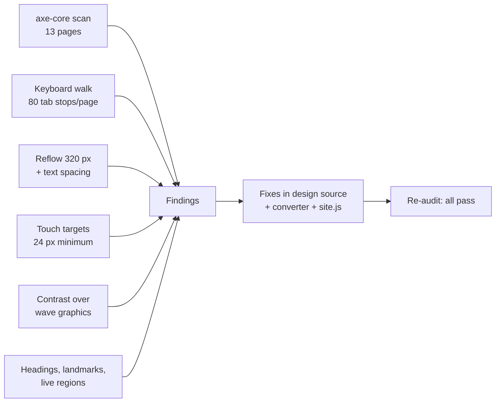

# Accessibility Audit: Alpha Preclinical website (review build)

**Standard:** WCAG 2.1 AA (plus WCAG 2.2 target size 2.5.8) | **Date:** October 1, 2026 | **Pages:** 13

## Summary

**Before fixes:** axe-core reported 0 violations, but manual and scripted checks found 9 issues (3 major, 6 minor).
**After fixes:** axe-core reports 0 violations on all 13 pages, and all 9 issues are resolved.

| | Before | After |
| --- | --- | --- |
| axe-core violations (wcag2a/aa, wcag21a/aa) | 0 | 0 |
| Pages failing reflow at 320 px | 2 | 0 |
| Pages failing text spacing (1.4.12) at 320 px | 2 | 0 |
| Nav, footer, breadcrumb and "Led by" links under 24 px | 311 across 10 pages | 0 (only links inside sentences remain, which are exempt) |
| Focusable elements without a visible focus ring | 0 | 0 |
| Pages with exactly one H1 | 10 / 10 | 13 / 13 |

Automated tools catch roughly a third of accessibility problems. Most findings below came from manual and scripted checks. A screen-reader pass with VoiceOver and NVDA is still recommended before launch.



## Findings

### Perceivable

| # | Issue | WCAG | Severity | Fix |
| --- | --- | --- | --- | --- |
| 1 | At some widths (around 1080 px) hero text could overlap the lighter wave bands, where white text would fail contrast. axe could not compute these backgrounds. | 1.4.3 Contrast | 🟡 Major | Hero bottom padding now scales with the band height; measured 29–59 px clearance at every width from 1440 to 320 px |
| 2 | Content wider than a 320 px screen: the "We're growing" team card (homepage) and the email address (contact) | 1.4.10 Reflow | 🟡 Major | Card spans the full row on phones; email addresses wrap |
| 3 | Same two elements overflowed with increased text spacing; legal pages also lost their mobile rules | 1.4.12 Text Spacing | 🟢 Minor | Fixed with 2; legal pages' mobile rules restored |
| 4 | Footer column titles were H3s under unrelated H2s; contact details panel had no heading of its own | 1.3.1 Info and Relationships | 🟢 Minor | Footer titles are H2s in a labeled `Footer` nav landmark; contact panel has a visually hidden H2 |

### Operable

| # | Issue | WCAG | Severity | Fix |
| --- | --- | --- | --- | --- |
| 5 | Homepage wave animation loops indefinitely with no way to pause it | 2.2.2 Pause, Stop, Hide | 🟡 Major | Added a "Pause animation" button (keyboard reachable, `aria-pressed`); starts paused when the device requests reduced motion |
| 6 | Nav, footer, breadcrumb and "Led by" links were 17–22 px tall | 2.5.8 Target Size (WCAG 2.2 AA) | 🟢 Minor | Padded to at least 24 px; remaining small links are inline within sentences (exempt) |

### Robust

| # | Issue | WCAG | Severity | Fix |
| --- | --- | --- | --- | --- |
| 7 | Filtering publications, blog posts or roles changed results silently for screen-reader users | 4.1.3 Status Messages | 🟢 Minor | A visually hidden `role="status"` line announces e.g. "Showing 2 papers in Gene regulation." |
| 8 | Careers role titles sat inside buttons, so they were not exposed as headings | 1.3.1 Info and Relationships | 🟢 Minor | Pattern changed to `<h3><button aria-expanded>…</button></h3>` |
| 9 | Form field outlines were 1.7:1 against white | 1.4.11 Non-text Contrast | 🟢 Minor | Darkened to `#7D8FAE` (3.3:1) |

### Passed checks

| Area | Result |
| --- | --- |
| Language, page titles, skip link, landmarks (header, nav, main, footer) | Present on every page |
| Alt text | Meaningful images described; decorative avatars and hover swaps use `alt=""` |
| Form labels, autocomplete, error text | Every field labeled; `autocomplete` on name, email, phone, organization; email error is described in text and focused |
| Focus visibility | Every focusable element shows a 3 px outline |
| Accordions | `aria-expanded` + `aria-controls`, one open at a time |
| Filters | `aria-pressed` toggle buttons inside a labeled group |
| Mobile menu | Button with `aria-expanded` and changing label |

## Color contrast

| Element | Foreground | Background | Ratio | Required | Pass |
| --- | --- | --- | --- | --- | --- |
| Body text | `#1F2858` | `#FFFFFF` | 14.0:1 | 4.5:1 | ✅ |
| Secondary text | `#4A5878` | `#FFFFFF` | 7.1:1 | 4.5:1 | ✅ |
| Links, primary buttons | `#1E58A0` / `#FFFFFF` | `#FFFFFF` / `#1E58A0` | 7.1:1 | 4.5:1 | ✅ |
| Hero heading | `#FFFFFF` | `#0F3360` | 12.6:1 | 3:1 (large) | ✅ |
| Hero secondary text | `#B9CCE3` | `#0F3360` | 7.7:1 | 4.5:1 | ✅ |
| Light button text | `#0F3360` | `#88C6EE` | 6.8:1 | 4.5:1 | ✅ |
| Topic tags | `#1E58A0` | `#EEF5FB` | 6.5:1 | 4.5:1 | ✅ |
| Footer text | `#B9CCE3` | `#0B2747` | 9.2:1 | 4.5:1 | ✅ |
| Form error | `#B3261E` | `#FFFFFF` | 6.5:1 | 4.5:1 | ✅ |
| Input borders | `#7D8FAE` (was `#B4C6DC`, 1.7:1) | `#FFFFFF` | 3.3:1 | 3:1 (1.4.11) | ✅ |

**Input borders** were darkened during the audit so form fields are identifiable by their outline alone, not only by their labels.

## Keyboard navigation

| Element | Tab order | Enter / Space | Escape | Arrows |
| --- | --- | --- | --- | --- |
| Skip link | First | Jumps to main content | — | — |
| Mobile menu button | After logo | Opens / closes menu | — | — |
| Hero pause button | After hero content | Pauses / plays waves | — | — |
| FAQ and job accordions | In reading order | Expands / collapses | — | — |
| Filter buttons | Left to right | Applies filter, announces count | — | — |
| Forms | Field order matches visual order | Submit validates | — | Native select |

## Screen reader

| Element | Announced as | Status |
| --- | --- | --- |
| Filter buttons | "Gene therapy, toggle button, not pressed" | ✅ |
| Filter result | "Showing 5 papers in Gene therapy." | ✅ |
| Job role | "Heading level 3, Senior Research Technician, In Vivo… button, expanded" | ✅ |
| Pause button | "Pause animation, toggle button, not pressed" | ✅ |
| Team hover photos | Not announced (`alt=""`) | ✅ |
| Form confirmation | Focus moves to "Message sent" status | ✅ |

## Remaining recommendations

1. **Manual screen-reader pass** with VoiceOver (macOS/iOS) and NVDA (Windows) before launch.
2. **Publication PDFs** come from journals and may not be tagged PDFs; the Accessibility Statement offers alternative formats on request.
3. **WordPress build:** keep these patterns in the block theme. Core blocks reintroduce some issues (for example, Navigation submenu targets and missing focus styles), so re-run this audit on the staging site.

## How to re-run

```bash
python3 -m http.server 8766 &
python3 docs/a11y-audit.py http://localhost:8766 audit.json
```

Requires Playwright (Python) and `axe-core` installed with npm; set `AXE_PATH` to `node_modules/axe-core/axe.min.js`.
